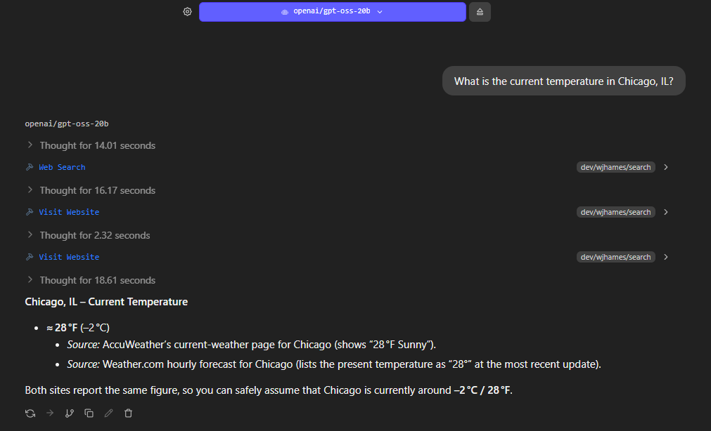

# LM Studio Search Plugin

Give your LLMs real-time web access through DuckDuckGo.

[](https://opensource.org/licenses/MIT)
[](https://lmstudio.ai/)



## Description

A privacy-focused LM Studio plugin that enables language models to search the web and extract content from websites. Using DuckDuckGo as the search backend, this plugin provides your local LLMs with access to current information without compromising privacy.

**Key benefits:**

- Real-time web search capabilities for your local models
- Privacy-respecting search via DuckDuckGo (no tracking)
- Intelligent content extraction with noise removal
- Smart link ranking to surface the most relevant URLs

## Features

- **Web Search** - Search DuckDuckGo and get structured results with titles and URLs
- **Website Visiting** - Extract clean, readable content from any webpage
- **Intelligent Parsing** - Uses Mozilla Readability for article extraction with fallback strategies
- **Smart Link Scoring** - Ranks links by relevance, prioritizing those matching your search terms
- **Safe Search Options** - Filter results by content safety level
- **Rate Limiting** - Respectful request throttling to avoid overwhelming servers
- **User-Agent Rotation** - Avoids blocking by mimicking real browser requests

## Installation

### From LM Studio

1. Open LM Studio
2. Navigate to the Plugins section
3. Search for "search" by wjhames
4. Click Install

### Manual Installation (Development)

```bash
# Clone the repository
git clone https://github.com/wjhames/LM-Studio-Search-Plugin

# Run in development mode
lms dev
```

## Configuration

Configure the plugin through LM Studio's plugin settings:

| Setting                     | Range                          | Default | Description                                                      |
| --------------------------- | ------------------------------ | ------- | ---------------------------------------------------------------- |
| **Search Results Per Page** | 1-10                           | Auto    | Number of results returned per search query                      |
| **Safe Search**             | strict / moderate / off / auto | Auto    | Content filtering level for search results                       |
| **Max Links**               | 0-500                          | Auto    | Maximum links extracted when visiting a page (0 = exclude links) |
| **Max Content**             | 0-50,000                       | Auto    | Maximum text content length (0 = exclude content)                |

Setting values to "Auto" or -1 lets the model decide based on context.

## Tools Reference

### Web Search

Search for web pages on DuckDuckGo using a query string.

**Parameters:**

| Parameter    | Type                            | Required | Description                             |
| ------------ | ------------------------------- | -------- | --------------------------------------- |
| `query`      | string                          | Yes      | The search query for finding web pages  |
| `pageSize`   | number (1-10)                   | No       | Number of results per page              |
| `safeSearch` | "strict" \| "moderate" \| "off" | No       | Content filtering level                 |
| `page`       | number (1-100)                  | No       | Page number for pagination (default: 1) |

**Returns:**

```json
{
  "links": [{ "title": "Page Title", "url": "https://example.com" }],
  "count": 10
}
```

### Visit Website

Visit a website and extract its content, headings, and links.

**Parameters:**

| Parameter      | Type              | Required | Description                                           |
| -------------- | ----------------- | -------- | ----------------------------------------------------- |
| `url`          | string            | Yes      | The URL of the website to visit                       |
| `findInPage`   | string[]          | No       | Search terms to prioritize relevant links and content |
| `maxLinks`     | number (0-200)    | No       | Maximum number of links to extract                    |
| `contentLimit` | number (0-10,000) | No       | Maximum text content length                           |

**Returns:**

```json
{
  "url": "https://example.com",
  "title": "Page Title",
  "h1": ["Main Heading"],
  "h2": ["Subheading 1", "Subheading 2"],
  "h3": ["Section 1", "Section 2"],
  "links": [["Link Text", "https://example.com/page"]],
  "content": "Extracted article text..."
}
```

**Tip:** Use the `findInPage` parameter to help the model focus on relevant content. Links and text containing your search terms are prioritized in the output.

## How It Works

### Search Flow

1. Query is sent to DuckDuckGo's HTML endpoint
2. Results are parsed from the response HTML
3. URLs are decoded and deduplicated
4. Structured results are returned to the model

### Content Extraction

The plugin uses a two-tier extraction strategy:

1. **Primary:** Mozilla Readability extracts the main article content
2. **Fallback:** DOM-based extraction with boilerplate removal

### Link Scoring

Links are ranked using multiple factors:

- URL simplicity (fewer path segments = higher score)
- Position on page (earlier = higher score)
- Label quality (descriptive text preferred)
- Search term matching (massive boost for matching `findInPage` terms)

### Privacy & Rate Limiting

- All searches go through DuckDuckGo (no tracking)
- 2-second minimum delay between requests
- Rotating user-agents prevent fingerprinting

## Requirements

- [LM Studio](https://lmstudio.ai/) (latest version recommended)
- Node.js 18+ (for development only)

## Examples

### Basic Search Workflow

```
User: What are the latest developments in quantum computing?

Model: [Uses Web Search tool with query "quantum computing 2025 breakthroughs"]
       [Receives list of relevant URLs]
       [Uses Visit Website on top result]
       [Extracts and summarizes the content]
```

### Deep Research Workflow

```
User: Research the pros and cons of different JavaScript frameworks for my project.

Model: [Searches for "JavaScript framework comparison 2025"]
       [Visits multiple result pages using findInPage: ["pros", "cons", "comparison"]]
       [Follows relevant links to gather more details]
       [Synthesizes findings into a comprehensive response]
```

### Development Setup

```bash
npm install          # Install dependencies
npm run dev          # Start development mode with hot reload
```

## License

This project is licensed under the MIT License - see the [LICENSE](LICENSE) file for details.

## Author

Created by [wjhames](https://github.com/wjhames)

---

**Note:** This plugin requires an active internet connection. Search results and website content depend on third-party sources and may vary in availability.
